# 强网杯2019-随便注题目分析

在BUUCTF上web板块第二题发现的该题目，本人对sql注入漏洞比较关注，所以仔细分析一下本题目

首先访问是这样的

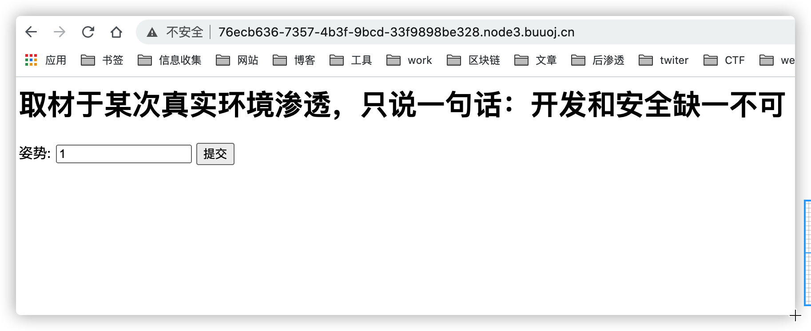

提交"1"的时候是这样的

 

加入一个单引号(为了方便观察，burpsuit上测试)，报错


加两个单引号，正常。由此判断存在注入。

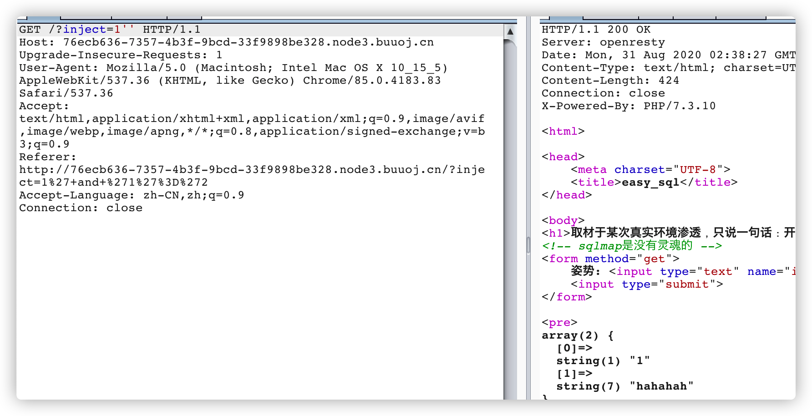

再看报错的内容，报错提示MariaDB数据库，MariaDB数据库管理系统是MySQL的一个分支，主要由开源社区在维护，因此MariaDB的注入，我们当成是MySQL的注入就OK。

既然有报错，我们首先想到的是MySQL报错注入。

### 报错注入测试

不管三七二十一先用floor()打一波,结果显示过滤掉了select。

```
' and (select count(*) from information_schema.tables group by concat(0x7e,(select version()),0x7e,floor(rand(0)*2)))--+
```

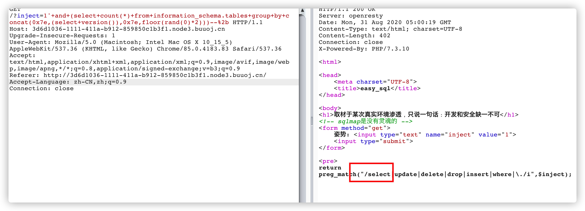

既然不让用，就不用杯，xpath报错安排上。如下图，成功注入出了版本信息。

```
1'+and+extractvalue(1,concat(0x7e,(@@version),0x7e))
```


当前数据库也出来了

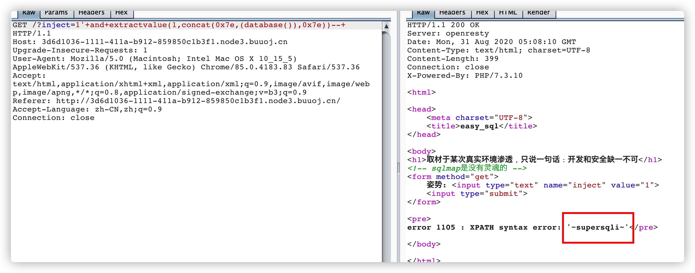

用户是user

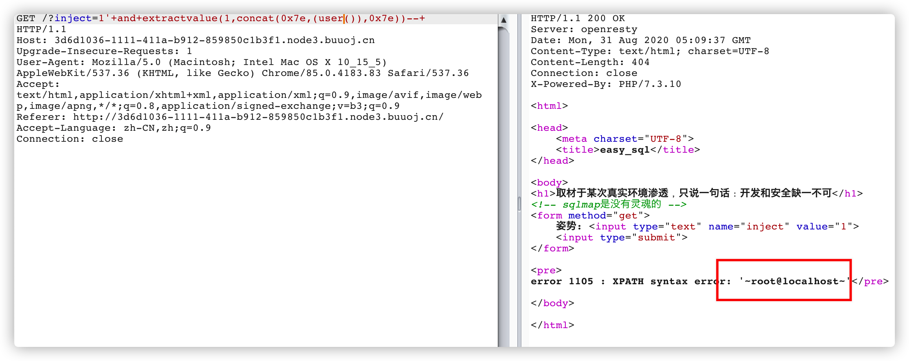

不能用select就很烦呀。还是得注入出其他数据才能获取flag，绕过开始了，

### 绕过测试

我们在select前后加上正常的字符，发现还是被拦截了，显然这是正则硬匹配字符串。所以注释加换行的思路可以宣告不可用。

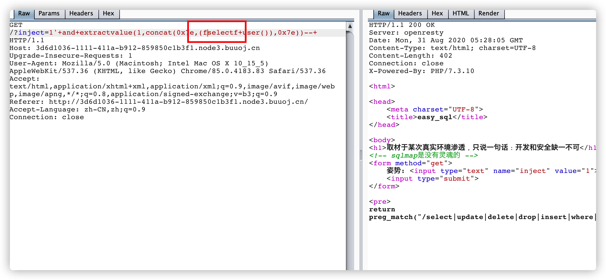

想改为POST数据包，用分块和编码绕过也是不行，不支持用POST传输数据。这条路也不通了。

再能想到的方法就是利用正则回溯法，用超常字符串绕过。但是在openresty下是行不通的，有最大长度限制。

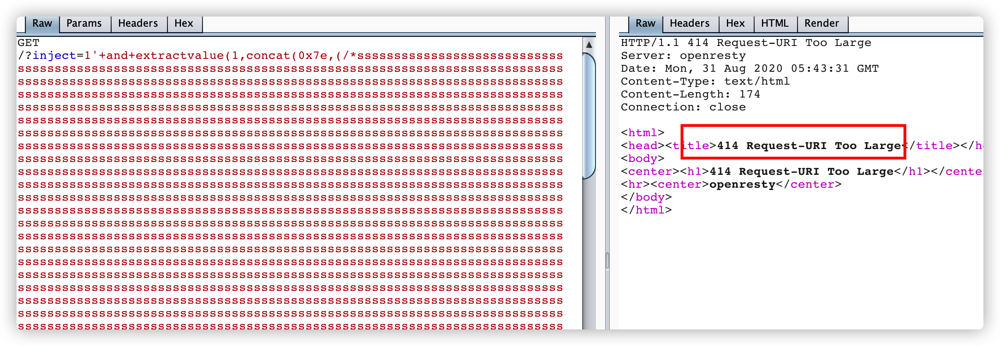


放弃了绕过的方式。

翻阅了一下，看writeup说堆叠查询。于是开始了堆叠查询之路

### 堆叠查询

堆叠查询就是在“；”之后插入任意的SQL语句。

**首先要知道堆叠查询支持的场景**

SQL Server 支持

MySQL 5 及之后支持

PostgreSQL支持

<u>Oracle不支持堆叠查询。</u>


通过上面的查询知道这里MariaDB是10.3.18，猜想应该是基于MySQL5之后。试了再说。

```
1';show tables;-- 
```

查询所有的表，共发现两个，1919810931114514和words。


分别查看两个表的列。

注：*在mysql中，对表名为纯数字的表进行操作时，要在表名前后加上反引号*

```
1';show columns from `1919810931114514`;-- 
1';show columns from words;-- 
这里也可以用desc。
1';desc words;--
```

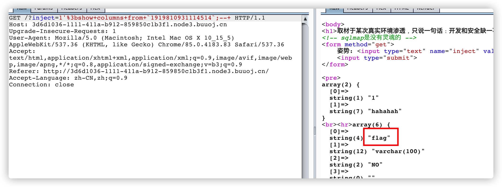


由此可知，flag在“1919810931114514”表中。到这我们预编译就可以查出flag了

```
set @sql = CONCAT('se','lect * from `1919810931114514`;');//通过concat拼接绕过select检测
prepare flag from @sql;
EXECUTE flag;
```

但是远远没有这个简单，出现了strstr()报错，不应该出现prepare。


于是网上搜索strstr()绕过，首先就出现了大小写绕过。果断把prepare改成Prepare。嘻嘻，成功拿到flag

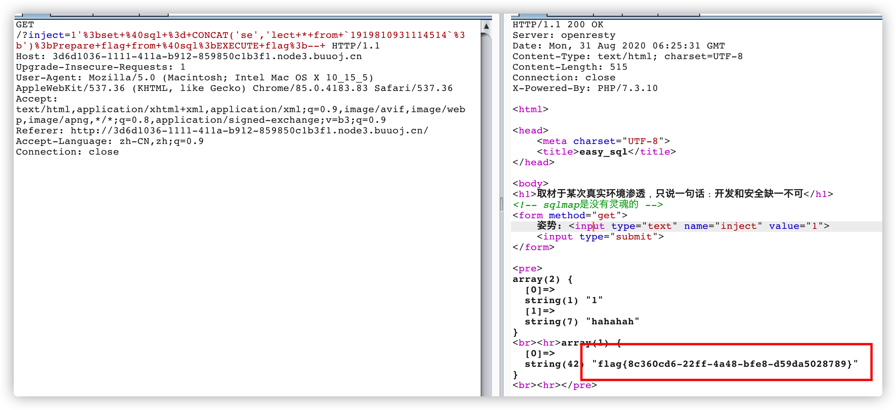

除此之外，网上的大多数writeup是通过修改表名来获取flag的，这里也复现一下

通过1' or '1'='1来获取所有当前表的内容并没有flag字段，又由于总共只有两个表。由此可知，当前表是words，如果不用select来查询其他表的内容呢？通过修改表名的方式来实现。将当前表改为其他表名，将“1919810931114514”改为“words"那么查询当前表实际上就是查询的“1919810931114514”表的内容。


```
alter table words rename to words1;
alter table `1919810931114514` rename to words;
alter table words change flag id varchar(50);//将字段名flage改为原先的id。

总的语句
1';alter+table+words+rename+to+words1;alter+table+`1919810931114514`+rename+to+words;alter+table+words+change+flag+id+varchar(50);
```


用' or '1'='1获取所有结果获取到了flag。

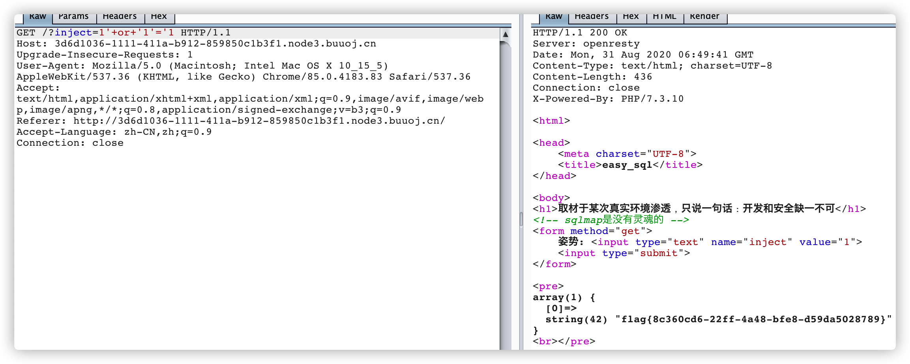

审查一下源码：https://github.com/glzjin/qwb_2019_supersqli/blob/master/files/html/index.php

使用了multi_query()来执行多条sql语句。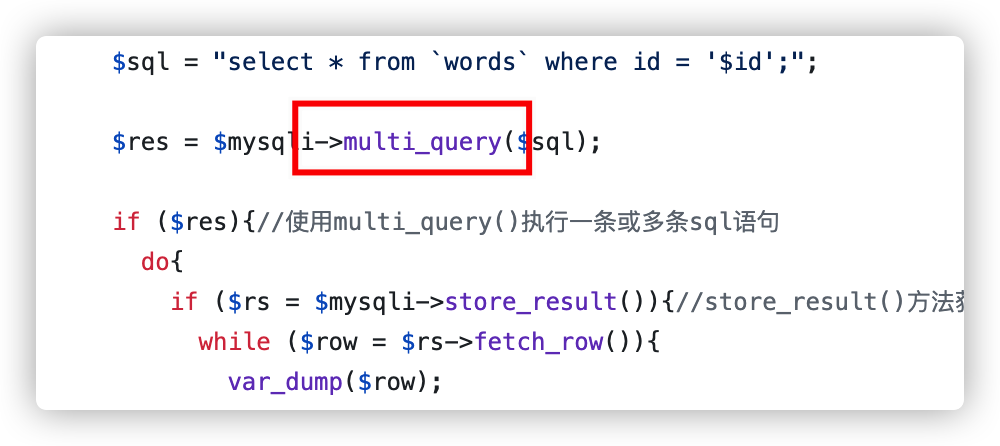


知识点总结：

1. 在mysql中，对表名为纯数字的表进行操作时，要在表名前后加上反引号
2. mysql查询列名show columns from words
3. desc查询表结构desc words
4. 通过预编译绕过关键词。
5. strstr()可以用大小写绕过。
6. multi_query()可以执行多条sql语句，造成堆叠查询，审查源码的时候得注意。